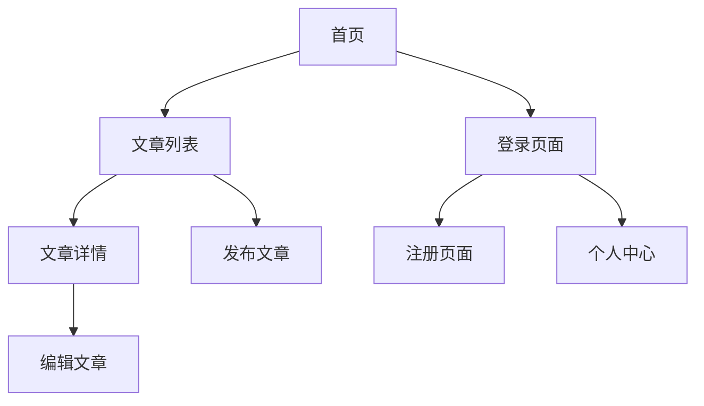

## 1. 产品概述
使用 GitHub Pages 与 Supabase 开发功能完整、安全的个人博客系统。支持文章发布、用户管理，通过 RLS 确保数据安全。

## 2. 核心功能

### 2.1 用户角色
| 角色 | 注册方式 | 核心权限 |
|------|----------|----------|
| 访客 | 无需注册 | 浏览已发布文章 |
| 注册用户 | 邮箱/第三方OAuth | 发布、编辑、删除自己的文章 |

### 2.2 功能模块
核心页面包括：
1. **首页**：文章列表展示、导航栏
2. **文章详情页**：文章内容、作者信息
3. **发布/编辑页**：文章编辑表单
4. **登录/注册页**：用户认证界面
5. **个人中心**：用户资料管理

### 2.3 页面详情
| 页面名称 | 模块名称 | 功能描述 |
|----------|----------|----------|
| 首页 | 文章列表 | 展示所有已发布文章，支持分页 |
| 首页 | 导航栏 | 站点logo、登录状态、发布按钮 |
| 文章详情 | 内容展示 | 显示文章标题、内容、发布时间 |
| 文章详情 | 操作按钮 | 登录用户可编辑/删除自己的文章 |
| 发布编辑 | 表单 | 输入标题、富文本内容 |
| 发布编辑 | 发布按钮 | 保存并发布文章 |
| 登录注册 | 认证表单 | 邮箱密码登录或第三方OAuth |
| 个人中心 | 资料管理 | 修改用户名、头像 |

## 3. 核心流程
用户访问首页浏览文章 → 点击文章查看详情 → 注册用户可发布新文章 → 作者可编辑或删除自己的文章。

## 4. 用户界面设计

### 4.1 设计风格
- 主色调：蓝色系 (#3B82F6)
- 辅助色：灰色系 (#6B7280)
- 按钮样式：圆角矩形，hover效果
- 字体：系统默认字体，标题18-24px，正文16px
- 布局：卡片式设计，响应式网格
- 图标：使用简洁的线性图标

### 4.2 页面设计
| 页面名称 | 模块名称 | UI元素 |
|----------|----------|--------|
| 首页 | 文章卡片 | 白色卡片、阴影效果、标题加粗、摘要文本 |
| 文章详情 | 内容区域 | 大标题、分隔线、正文段落间距 |
| 编辑页 | 表单输入 | 边框输入框、富文本编辑器、发布按钮 |
| 登录页 | 认证卡片 | 居中卡片、输入框、提交按钮 |

### 4.3 响应式设计
桌面优先设计，移动端自适应。断点：768px（平板）、1024px（桌面）。