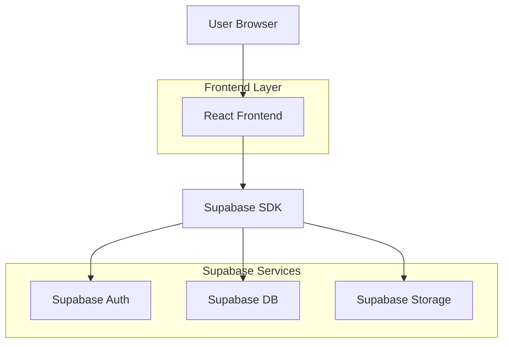
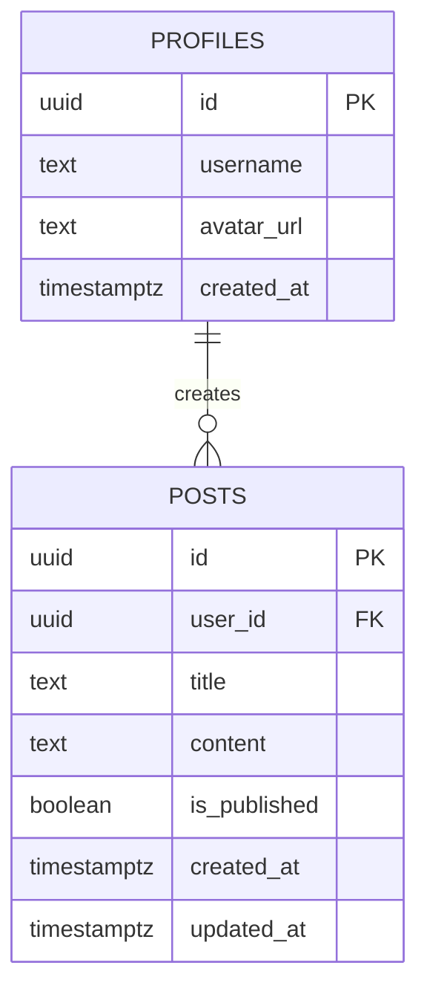

## 1. 架构设计



## 2. 技术栈
- 前端：React@18 + TypeScript + Vite
- UI框架：Tailwind CSS@3
- 路由：React-Router-DOM@6
- 后端服务：Supabase（认证+数据库+存储）
- 初始化工具：vite-init

## 3. 路由定义
| 路由 | 用途 |
|------|------|
| / | 首页，展示文章列表 |
| /login | 登录页面 |
| /register | 注册页面 |
| /post/:id | 文章详情页 |
| /post/new | 发布新文章 |
| /post/:id/edit | 编辑文章 |
| /profile | 个人资料页 |

## 4. 数据模型

### 4.1 数据库实体关系


### 4.2 数据定义语言

**profiles表**
```sql
-- 创建表
CREATE TABLE profiles (
  id UUID PRIMARY KEY REFERENCES auth.users(id),
  username TEXT UNIQUE NOT NULL,
  avatar_url TEXT,
  created_at TIMESTAMP WITH TIME ZONE DEFAULT NOW()
);

-- RLS策略
ALTER TABLE profiles ENABLE ROW LEVEL SECURITY;
CREATE POLICY "用户只能查看自己的资料" ON profiles FOR SELECT USING (auth.uid() = id);
CREATE POLICY "用户只能更新自己的资料" ON profiles FOR UPDATE USING (auth.uid() = id);
```

**posts表**
```sql
-- 创建表
CREATE TABLE posts (
  id UUID PRIMARY KEY DEFAULT gen_random_uuid(),
  user_id UUID NOT NULL REFERENCES profiles(id),
  title TEXT NOT NULL,
  content TEXT NOT NULL,
  is_published BOOLEAN DEFAULT false,
  created_at TIMESTAMP WITH TIME ZONE DEFAULT NOW(),
  updated_at TIMESTAMP WITH TIME ZONE DEFAULT NOW()
);

-- RLS策略
ALTER TABLE posts ENABLE ROW LEVEL SECURITY;
CREATE POLICY "所有用户可查看已发布文章" ON posts FOR SELECT USING (is_published = true);
CREATE POLICY "认证用户可创建文章" ON posts FOR INSERT WITH CHECK (auth.uid() = user_id);
CREATE POLICY "用户只能更新自己的文章" ON posts FOR UPDATE USING (auth.uid() = user_id);
CREATE POLICY "用户只能删除自己的文章" ON posts FOR DELETE USING (auth.uid() = user_id);
```

### 4.3 权限配置
```sql
-- 授权给匿名用户
GRANT SELECT ON posts TO anon;
GRANT SELECT ON profiles TO anon;

-- 授权给认证用户
GRANT ALL PRIVILEGES ON posts TO authenticated;
GRANT ALL PRIVILEGES ON profiles TO authenticated;
```

## 5. 环境配置

**.env.local文件示例**
```bash
VITE_SUPABASE_URL=https://your-project.supabase.co
VITE_SUPABASE_ANON_KEY=your-anon-key
```

**Supabase CORS配置**
- Site URL: `https://username.github.io`
- Redirect URLs: 
  - `https://username.github.io`
  - `http://localhost:5173`（开发环境）